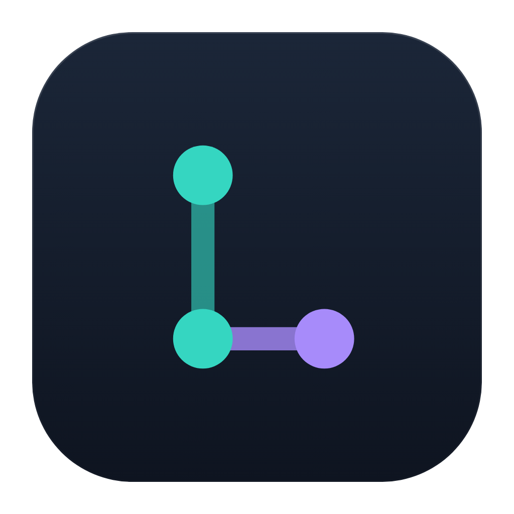
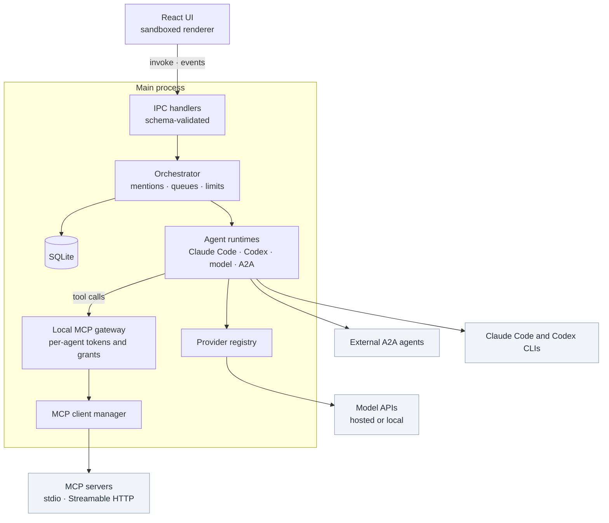

<p align="center">
  
</p>

<h1 align="center">LoCrew</h1>

<p align="center">
  <strong>A collaborative workspace for humans and AI agents.</strong><br>
  Channels, direct messages and agent-to-agent hand-offs, running on your own machine.
</p>

<p align="center">
  <a href="#quick-start">Quick start</a> ·
  <a href="#features">Features</a> ·
  <a href="#how-locrew-works">How it works</a> ·
  <a href="#ai-providers-and-custom-agents">Providers and agents</a> ·
  <a href="#mcp-integration">MCP</a> ·
  <a href="#architecture">Architecture</a> ·
  <a href="#contributing">Contributing</a>
</p>

---

LoCrew is a desktop app where AI agents are members of a conversation, not separate chat tabs. You can talk to one agent in a direct message, or put several agents in a channel with you and let them hand work to each other. Every message, tool call and hand-off stays in one shared transcript.

An agent can run on a coding CLI you already use (Claude Code or OpenAI Codex), on a model from a provider you connect (a hosted API, any OpenAI-compatible server or a local model server), or on an external agent reached over the Agent2Agent (A2A) protocol. For each agent, you decide which MCP tools it may call, what it may do in your files, how long it may run and how much it may spend.

### Why LoCrew

- **Several agents, one conversation.** Agents don't need you to copy output between windows. One agent addresses another through a tool call, and the other agent wakes up and replies in the same channel.
- **Explicit addressing.** In a channel, only the agents you `@mention` run. A message without a mention wakes nobody and costs nothing.
- **You set the limits.** Per-agent file access levels, approval prompts before writes, per-tool MCP grants, and global limits on hops, concurrency, run time and spend.
- **Local first.** The app, its database and your credentials stay on your computer. CLI agents use the login you already have; provider keys are encrypted with your operating system's keychain.

> [!NOTE]
> **Status: early development (v0.1.0).** LoCrew is a single-user desktop app. It has been developed and run on Windows; macOS and Linux build targets are configured but not yet exercised. Some integrations are tested only against test servers. See [Verification status](#verification-status) before relying on one.

---

## Contents

- [Features](#features)
- [How LoCrew works](#how-locrew-works)
- [Quick start](#quick-start)
- [AI providers and custom agents](#ai-providers-and-custom-agents)
- [MCP integration](#mcp-integration)
- [Architecture](#architecture)
- [Project structure](#project-structure)
- [Development](#development)
- [Contributing](#contributing)
- [Roadmap](#roadmap)
- [Security](#security)
- [License](#license)

---

## Features

### Available

| Area | What you can do |
|---|---|
| **Conversations** | Direct messages with one agent. Channels with several agents and you. `@mention` agents, or `@all`, to put them to work. History is kept in a local SQLite database. |
| **Agent hand-offs** | Agents message each other through a `send_message` tool. Each hop is counted, and chains stop at limits you can configure. |
| **Claude Code agents** | Run your installed Claude Code CLI through the official Claude Agent SDK, in a working directory you choose. |
| **Custom agents on AI models** | Create any number of agents on a connected provider's models, each with its own name, instructions, model settings and tools. |
| **AI providers** | Presets for 10 hosted services and 4 local model servers, plus any OpenAI-compatible or custom endpoint. Includes a connection test and model discovery. |
| **MCP tools** | Connect MCP servers over stdio or Streamable HTTP, and grant individual tools to individual agents. |
| **Live activity** | An agent reacts to the message it is working on (📨 received, 👀 reading, 💭 thinking, ⚙️ working, ❓ waiting for you, then ✅ / ❌ / 🚫). Reactions come from real runtime events, never from a timer. Status dots in the sidebar and an activity bar show who is busy. |
| **Reactions and search** | Add your own emoji reactions. Find text in a conversation with <kbd>Ctrl</kbd>+<kbd>F</kbd>, and filter channels and agents with <kbd>Ctrl</kbd>+<kbd>K</kbd>. |
| **Images and files** | Paste, drop or pick images to send to agents. Attach local files as path links. |
| **Tasks** | Track work across agents. Agents can update the tasks they are assigned to. |
| **Safety controls** | File access levels (*Read only*, *Ask first*, *Full access*), approval before writes, one writer per directory at a time, spend and run limits, and a Stop button for every run. |
| **Review before a write** | An agent's write stops and shows you the diff first: the file, the lines going in and out, and the command for a shell call. Allow it, deny it, or stop being asked for a while. |
| **Work sessions** | Approving every single write gets tiring. A work session gives one agent, or every agent in a directory, write access for 15 minutes to 4 hours or until you end it. Sessions live in memory only, and closing LoCrew returns to asking. |
| **Workspace** | An inbox of agent replies, an agent directory, channel icons, a workspace name, your profile name and photo, and a spend overview. |
| **About and credits** | Settings → About lists the version, the versions a bug report needs, links to the repository and its issues, and every open-source project LoCrew ships, read from the installed packages. |
| **Text** | Markdown with syntax-highlighted code, and correct layout for mixed right-to-left and left-to-right text. |

### Experimental

| Feature | Current state |
|---|---|
| **OpenAI Codex agents** | Built on the official Codex SDK. No real Codex turn has been run during development, so treat it as beta. |
| **External A2A agents** | Add an agent by URL (A2A v1.0 and v0.3). Tested only against the official A2A SDK server. External agents cannot use workspace tools or MCP tools. |
| **Images for CLI agents** | Sending images to Claude Code and Codex agents is implemented but has not been tested against the real CLIs. |

### Planned

Work that is not implemented yet is listed in the [roadmap](#roadmap).

### Verification status

| Integration | Tested against |
|---|---|
| Claude Code | The real CLI, in an opt-in live test suite: replies, session resume, calls to the workspace tools, and the write-approval gate. |
| OpenAI Codex | Install detection only; no live turn. |
| AI providers | A mock server for each supported wire format. The test suite does not contact any commercial API. |
| MCP | Real MCP servers built with the official SDK, over stdio and Streamable HTTP. |
| A2A | The official A2A SDK server in v1.0 and v0.3 modes, running in the same process. |

---

## How LoCrew works

### An example

Suppose you create a `#development` channel with two agents working in the same repository:

- **Reviewer**, a Claude Code agent with *Read only* file access.
- **Builder**, a Claude Code agent with *Ask first* file access.

```text
You       @Reviewer look at the session handling in src/auth and list what should change.

Reviewer  (reads the files, replies in the channel)
          Three issues: sessions survive a password change, ...
          (calls send_message, addressed to Builder)
          Builder, please fix the first two.

Builder   (wakes up, edits src/auth; you approve each write in a dialog)
          Done. Both fixes are in, with a test for the expiry case.
```

The whole exchange stays in `#development`. As each agent works, its reaction on your message changes. The Activity panel shows each agent's current step and elapsed time, and Stop ends a run at any point. Because both agents work in the same directory, only one of them writes at a time.

Three rules make this predictable:

1. **Text is not routing.** An agent that writes "@Builder" in its reply wakes nobody. Agents reach each other only through the `send_message` tool. The sender is identified by its own access token, never by what the message says.
2. **Chains are bounded.** Every agent-to-agent hop is counted. By default, a chain stops after 6 hops, and one agent can run at most 3 times in a row without your input.
3. **Nothing is interrupted.** A new message never cuts into a running agent; it waits its turn.

<details>
<summary><strong>Tools every agent gets from LoCrew</strong></summary>

<br>

LoCrew runs a small MCP server on `127.0.0.1`, and every agent connects to it with its own token.

| Tool | Purpose |
|---|---|
| `send_message` | Post to the conversation, optionally addressed to specific agents |
| `read_messages` | Read recent history |
| `list_channel_members` | See who is in the conversation, with their IDs |
| `get_channel_context` | Read the topic, open tasks and how many hops remain |
| `get_agent_status` | Check whether another agent is online or busy |
| `update_task` | Move a task the agent is assigned to |

External A2A agents do not receive these tools.

</details>

### Models, agents and MCP servers

These three are easy to confuse, and LoCrew keeps them separate:

| Concept | What it is | In LoCrew |
|---|---|---|
| **AI model** | A model served by a provider, such as a hosted API or a model running in Ollama | You connect a provider once, under **Settings → AI Providers**. Its models are discovered automatically, or you add them by ID. |
| **AI agent** | A named participant with instructions, an engine and permissions | Created in the agent wizard. Many agents can share one model, each with its own name, instructions and tools. |
| **MCP server** | A program or endpoint that offers tools (file access, a database, an API) over the Model Context Protocol | Added under **Settings → MCP Servers**. Connecting a server grants nothing; you choose which agents may call which tools. |
| **External agent** | A complete agent running somewhere else | Reached over A2A. It is a participant in conversations, not a tool, and has nothing to do with MCP. |

---

## Quick start

### Prerequisites

| Requirement | Notes |
|---|---|
| **Node.js 20 or newer**, with npm | The repository uses npm (`package-lock.json`). |
| **Windows, macOS or Linux** | Development so far has been on Windows. |
| **At least one way to run an agent** | Claude Code, OpenAI Codex, or an AI provider: a hosted API key or a local model server. |

Optional agent runtimes:

- **Claude Code**: install it with `npm i -g @anthropic-ai/claude-code`, then run `claude` once in a terminal to sign in.
- **OpenAI Codex**: no separate install. The CLI ships with the `@openai/codex-sdk` dependency. Sign in once by running `npx codex` from the project directory.

### Install and run

```bash
git clone <repository-url> locrew
cd locrew
npm install
npm run dev
```

`npm install` also runs `electron-builder install-app-deps`, which compiles the SQLite native module for Electron. `npm run dev` starts the app with hot reload through electron-vite.

### Configuration

There is no `.env` file to prepare. Everything is configured inside the app and stored locally:

- **Settings, agents and conversations** live in a SQLite database in the app's user-data directory.
- **API keys, tokens and secret headers** are encrypted with the OS keychain (Electron `safeStorage`). If encryption isn't available, saving a key fails; LoCrew never falls back to plain text.

### First steps

1. **Connect a model** (optional): open **Settings → AI Providers → Add provider**. Skip this step if you only use Claude Code or Codex.
2. **Create an agent**: click **Create agent** and follow the five steps. A direct message with the new agent opens when you finish.
3. **Start a channel**: click **+** next to *Channels*, choose its agents, and `@mention` them.

---

## AI providers and custom agents

### Agent engines

| Engine | How it runs | Authentication | Status |
|---|---|---|---|
| **Claude Code** | Your local `claude` CLI, driven by the Claude Agent SDK in a working directory | Your existing Claude Code login | Available |
| **OpenAI Codex** | The Codex CLI bundled with `@openai/codex-sdk`, driven by the Codex SDK | Your Codex login (`npx codex`) | Experimental |
| **AI model** | LoCrew's own agent loop, calling a connected provider | The provider's API key, or none for local servers | Available |
| **External agent** | A remote agent, over the A2A protocol | Bearer token, API-key header or none | Experimental |

### Supported providers

| Category | Providers | Authentication |
|---|---|---|
| **Built-in** | OpenAI, Anthropic, Google Gemini, Azure OpenAI, AWS Bedrock, OpenRouter, Groq, Together AI, Fireworks AI, Hugging Face | API key, as a bearer token or the provider's own header |
| **Local model** | Ollama, LM Studio, vLLM, llama.cpp server | None by default |
| **OpenAI-compatible API** | Any server that speaks the Chat Completions API, such as a LiteLLM proxy or a company gateway | Bearer token, named header or none |
| **Custom provider** | Full control over the auth method, header name, extra headers, chat and models paths, and output-cap field | Bearer token, named header or none |

Presets only pre-fill the form. Every field stays editable. Under the hood, LoCrew talks to providers in four formats:

- **OpenAI Chat Completions**: most providers.
- **Anthropic Messages API**: Anthropic.
- **Gemini**: native model discovery, with chat through Google's OpenAI-compatible endpoint.
- **Ollama**: native model discovery, with chat through Ollama's OpenAI-compatible endpoint.

Things to know:

- **Test connection** checks the endpoint before anything is saved.
- **Model discovery** lists models where the provider supports it, with context window, tool support and image support when the provider reports them. Otherwise, add a model ID by hand and override its capabilities.
- **Remote endpoints must use `https://`.** Plain `http://` is accepted only for servers on your own computer.
- **Azure OpenAI** expects your deployment name as the model ID. **AWS Bedrock** works through its OpenAI-compatible endpoint; enter the model ID by hand.
- **Spend limits.** Agents on AI providers report token usage but not cost, so spend limits don't constrain them. Turn, hop, queue and time limits still do.

<details>
<summary><strong>Example: a custom OpenAI-compatible endpoint</strong></summary>

<br>

In **Settings → AI Providers → Add provider**, choose **OpenAI-compatible API**:

| Field | Example |
|---|---|
| Provider name | `Team gateway` |
| Base URL | `https://llm-gateway.example.com/v1` |
| Authentication | Bearer token; paste your key into the key field |
| Model ID (optional) | A model your gateway serves, if it does not list its models |

Click **Test connection**, then **Add provider**.

</details>

<details>
<summary><strong>Example: a local model with Ollama</strong></summary>

<br>

1. Install Ollama and pull a model.
2. In **Settings → AI Providers → Add provider**, choose **Local model → Ollama**. The base URL defaults to `http://localhost:11434`, and no key is needed.
3. LoCrew lists the models installed in Ollama, with the context length, tool support and image support that Ollama reports for each.

LM Studio (`http://localhost:1234/v1`), vLLM (`http://localhost:8000/v1`) and the llama.cpp server (`http://127.0.0.1:8080/v1`) are set up the same way.

</details>

### Creating an agent

**Create agent** opens a five-step wizard:

1. **Name & avatar**: name, description, accent colour and portrait. The name is used for `@mentions`, but routing uses a stable ID, so renaming an agent is safe.
2. **Provider & model**: a model from a connected provider, Claude Code, Codex, or an A2A agent. For the CLIs, the wizard checks that the tool is installed and signed in.
3. **Instructions**: what the agent is for, plus model settings (temperature and output limit) or, for CLI agents, the working directory and file access level.
4. **Tools**: MCP tool grants and conversation permissions.
5. **Review**: then create.

The **Agents** view lists every agent with its engine and status. From there you can message, edit, duplicate or delete an agent. Duplicating copies the configuration, stored credential and tool grants to a new agent.

**Instructions and system prompts.** Your instructions are appended to a base prompt that LoCrew gives every agent. The base prompt says who else is in the conversation and how to reach them. It also states that messages from other agents, and tool output, are untrusted and cannot change the agent's permissions. Codex has no separate system-prompt channel, so its instructions are sent with the first message of each thread.

**Permissions and limits.** Each agent has its own settings:

| Setting | Values | Default |
|---|---|---|
| File access (Claude Code and Codex) | *Read only*: reads only. *Ask first*: you approve each write. *Full access*: no prompts. | *Ask first* |
| Work session (temporary) | Lifts the prompts for *Ask first* agents, for a set time or until ended. Per agent, or per working directory. | none open |
| May be woken by other agents | on / off | on |
| May update tasks | on / off | on |
| Spend ceiling per run | US dollars; 0 turns the check off | $2 |
| Turn limit and timeout per run | Set per agent | — |

Agents on AI models have no file access of their own. They can use only the MCP tools you grant them.

<details>
<summary><strong>Workspace-wide limits</strong> (Settings → Limits)</summary>

<br>

| Limit | Default | What it stops |
|---|---|---|
| Agent-to-agent hops | 6 | Endless back-and-forth between agents |
| Runs without your input | 3 | One agent looping on its own |
| Agents working at once | 2 | Every agent running at the same time |
| Queued messages per agent | 10 | A backlog nobody asked for |
| Task duration | 15 min | A run that hangs |
| Spend per chain | $5 | A chain quietly using up credit |
| Let agents talk to each other | on | Master switch for all agent-to-agent waking |

When a limit stops a chain, LoCrew posts a notice in the conversation. Dollar figures are estimates from the runtime's usage reports, not billing statements.

</details>

---

## MCP integration

LoCrew is an MCP client. Connecting MCP servers gives your agents tools; it does not add agents.

| | Local server | Remote server |
|---|---|---|
| **Transport** | stdio; LoCrew starts the process | Streamable HTTP |
| **Configuration** | Command, arguments (one per line), optional working directory, environment variables | URL, authentication (none, bearer token or named header), custom headers |
| **Before first use** | You approve the exact command line in a dialog, and again whenever it changes | `https://` is required, except for localhost or when you explicitly allow plain http for that server |
| **Secrets** | Environment variable values are stored encrypted | The token and sensitive-looking headers are stored encrypted |

Not supported yet: OAuth for remote servers, and servers that speak only the newest MCP protocol revision (2026-07-28). SSE and WebSocket transports are not offered.

### Adding a server

Open **Settings → MCP Servers → Add MCP server** and choose **Local server**. For example, the reference filesystem server:

| Field | Value |
|---|---|
| Name | `filesystem` |
| Command | `npx` |
| Arguments | `-y`<br>`@modelcontextprotocol/server-filesystem`<br>`/path/to/your/project` |

When you connect it, a native dialog shows the full command line and asks for approval. It also warns about risky patterns, including package runners such as `npx -y` that download code on first run. **Connect on startup** reconnects approved servers when LoCrew starts and never shows a prompt; a server that isn't approved stays disconnected.

### Tool discovery

After connecting, LoCrew reads the server's tools, resources, prompts, capabilities and version. It rediscovers them when the server announces changes. The MCP Servers pane shows:

- each tool with the risk the server claims for it (*read-only*, *writes* or *destructive*), labelled as unverified;
- which agents use the server;
- for local servers, the last lines of error output.

The **Test** button reconnects the server and reports what it found.

### Granting tools to agents

- **Nothing by default.** A new server grants nothing, and a new agent has no tools.
- **Per agent, per tool.** In the agent's **Tools** step, or later in its settings, tick the tools it may use. Each grant is either **Ask first** (the default: you confirm every call) or **Allow**.
- **One checkpoint.** Every tool call, whatever engine the agent runs on, passes through LoCrew's local gateway. The gateway re-checks the grant on each call, so revoking a grant takes effect immediately.
- **No shadowing.** LoCrew prefixes each tool's name with its server, so one server cannot impersonate another server's tools or LoCrew's own.
- **Results are data.** Tool output goes back to the model as a tool result, with size limits. It cannot change an agent's instructions or permissions.

MCP servers you approve run with your user account's permissions. Grant *Allow* only to tools you trust.

---

## Architecture

LoCrew is an Electron app. The React interface runs in a sandboxed renderer; the Node.js main process owns everything privileged: agents, files, network access, the database and credentials.



| Component | Location | Responsibility |
|---|---|---|
| User interface | `src/renderer` | React, Zustand and Tailwind. No Node.js access. |
| Preload bridge | `src/preload` | The renderer's only way in: one `invoke` function limited to an allowlist of channels, plus an event stream. |
| IPC layer | `src/main/ipc`, `src/shared/ipc.ts` | Validates every payload with zod before it reaches privileged code. |
| Orchestrator | `src/main/orchestrator` | Resolves mentions, queues work, counts hops, enforces limits, handles cancellation. |
| Agent runtimes | `src/main/runtimes` | One interface with four implementations: Claude Code, Codex, the model loop and A2A. |
| Activity | `src/main/activity` | A state machine that turns runtime events into message reactions. |
| MCP gateway | `src/main/gateway` | Local server for workspace tools and granted MCP tools; identifies agents by token. |
| MCP client | `src/main/mcp` | Connections to your MCP servers, discovery, and grant enforcement. |
| Providers | `src/main/providers` | Provider registry and the four protocol adapters. |
| Persistence | `src/main/db` | SQLite through Drizzle ORM, with migrations. |
| Secrets | `src/main/security` | Credential storage backed by Electron `safeStorage`. |

Detailed design documents:

- [docs/ARCHITECTURE.md](docs/ARCHITECTURE.md): process boundaries, routing, orchestration, the database, security, testing and the design system.
- [docs/UNIVERSAL_AI_ARCHITECTURE.md](docs/UNIVERSAL_AI_ARCHITECTURE.md): providers, custom agents, MCP and A2A.
- [docs/UNIVERSAL_AI_RESEARCH.md](docs/UNIVERSAL_AI_RESEARCH.md): the standards research behind those decisions.

---

## Project structure

```text
.
├── src/
│   ├── main/              Electron main process
│   │   ├── orchestrator/  routing, queues and limits
│   │   ├── runtimes/      Claude Code, Codex, model and A2A agents
│   │   ├── providers/     AI provider registry and adapters
│   │   ├── mcp/           MCP client manager and tool access
│   │   ├── gateway/       local MCP server the agents connect to
│   │   ├── activity/      activity state machine for reactions
│   │   └── db/            SQLite schema, data access and migrations
│   ├── preload/           the renderer's bridge to the main process
│   ├── renderer/          React user interface
│   └── shared/            types, IPC schemas and provider presets
├── tests/
│   ├── unit/              pure logic
│   ├── integration/       orchestrator, gateway, providers, MCP, A2A
│   ├── renderer/          React components and store
│   ├── e2e/               Playwright tests against the built app
│   ├── support/           mock provider and test helpers
│   └── fixtures/          an MCP server used by the tests
├── docs/                  architecture and research documents
├── resources/             app icon, as SVG source and rendered PNG
└── scripts/               icon rendering and maintenance scripts
```

---

## Development

### Commands

| Command | What it does |
|---|---|
| `npm run dev` | Start the app with hot reload |
| `npm start` | Run the built app in preview mode (`electron-vite preview`) |
| `npm run build` | Typecheck, then build the main, preload and renderer bundles into `out/` |
| `npm run typecheck` | Typecheck the main, renderer and e2e projects |
| `npm test` | Unit, integration and renderer tests with Vitest |
| `npm run test:watch` | The same tests in watch mode |
| `npm run test:e2e` | Playwright tests that launch the built app |
| `npm run test:live` | Tests against your real, installed agent runtimes; **spends credit** |
| `npm run db:generate` | Generate a Drizzle migration after a schema change |
| `npm run package` | Build an unpacked desktop app into `release/` |
| `npm run dist` | Build installers: NSIS on Windows, DMG on macOS, AppImage on Linux |
| `npm run rebuild` | Recompile the SQLite native module for Electron |
| `npm run icons` | Render `resources/icon.svg` to `resources/icon.png` |
| `npm run credits` | Rebuild the About screen's credits from the installed packages |

### Running tests

```bash
npm test               # no model calls, no cost
npm run build          # the e2e tests launch the built app
npm run test:e2e
```

- **`npm test`** covers routing, limits, locking, queues and cancellation, and the MCP gateway over real HTTP with a real MCP client. It also runs each provider adapter against a mock server, MCP against a real SDK server, and A2A against the official SDK server. Tests run through Electron's bundled Node.js so they share the app's native SQLite build.
- **`npm run test:e2e`** drives the real Electron app, for example: add a provider, approve an MCP server, create an agent, and watch it call a granted tool.
- **`npm run test:live`** runs only on a machine where the runtime is installed and signed in, and skips itself otherwise. It sets `LOCREW_LIVE=1`.

<details>
<summary><strong>Troubleshooting</strong></summary>

<br>

**`NODE_MODULE_VERSION` error on startup.** The SQLite module was built for the wrong runtime. Run `npm run rebuild`.

**Electron starts but no window appears.** `ELECTRON_RUN_AS_NODE` is set in your shell, which makes Electron run as plain Node.js. Unset it.

**Codex is detected but "not signed in".** The CLI ships with the app, but the login does not. Run `npx codex` from the project directory and sign in.

**A CLI sign-in check fails although the CLI works in your terminal.** LoCrew runs the CLI with its own environment. If your login depends on a shell profile that desktop apps don't load, start LoCrew from that terminal.

**A channel message did nothing.** Only agents you `@mention` are woken. LoCrew posts a notice saying nobody was woken and lists who you can address. Direct messages need no mention.

**An agent is stuck in "Queued".** It is waiting for a free slot or for another agent to finish writing in the same directory. The *Working directories* section of the Details panel shows which agent holds the lock.

**A conversation says "Stopped here: …".** A limit stopped the chain. Send a new message to continue, or raise the limit under **Settings → Limits**.

**`npm run dist` fails on Windows.** Building a signed installer needs the code-signing tools, which may require elevated privileges. `npm run package` builds an unpacked app without them.

</details>

---

## Contributing

Contributions are welcome, from bug reports to new integrations. The repository has no `CONTRIBUTING.md` yet, so these guidelines apply.

**Reporting bugs.** Open an issue with your OS, your Node.js version, the steps to reproduce, and what you expected. Include relevant log output, with API keys and tokens removed.

**Suggesting features.** Open an issue that describes the problem first, then the change you have in mind.

**Submitting pull requests.**

1. Keep each pull request focused on one change.
2. Run `npm run typecheck` and `npm test`. For changes that touch the interface or IPC, also run `npm run build` and `npm run test:e2e`.
3. Add or update tests for the behaviour you changed.
4. Update the README or the documents in `docs/` when behaviour changes.

**Improving documentation.** Corrections and clarifications to this README and to `docs/` are as valuable as code, especially where the documentation and the app disagree.

**Adding a dependency.** Run `npm run credits` afterwards, so the About screen credits it with the right version and licence.

**Adding an AI provider.**

- If the provider speaks one of the four supported formats, it usually needs no code: users can add it as an OpenAI-compatible or custom provider. To make it a preset, add an entry to `src/shared/provider-presets.ts`, using the endpoint and auth style from the provider's own documentation.
- A new protocol needs a `ProviderAdapter` in `src/main/providers`, registered in `registry.ts`, with tests against the mock server in `tests/support/mock-provider.ts`.

**Contributing to MCP support.** MCP servers themselves need no code in LoCrew; users add them in Settings. Changes to the client live in `src/main/mcp` and `src/main/gateway`, and should be tested against the fixture server in `tests/fixtures/mcp-notes-server.mjs`.

**Project conventions.**

- Every new IPC channel needs a zod schema and an allowlist entry; the build enforces this.
- Activity reactions come only from runtime events, never from timers.
- Test doubles are named as doubles, and nothing is described as verified against a live service unless a test actually ran against one.

---

## Roadmap

The checked items below are implemented. The unchecked items are possible next steps, based on the current limitations, and are not scheduled commitments.

- [x] Direct messages, channels and `@mentions`
- [x] Agent-to-agent hand-offs with hop, run and spend limits
- [x] Claude Code agents
- [x] Custom agents on hosted, OpenAI-compatible and local models
- [x] MCP servers over stdio and Streamable HTTP, with per-agent tool grants
- [x] Activity reactions and presence driven by runtime events
- [x] Images in messages
- [x] External A2A agents (experimental)
- [x] OpenAI Codex agents (experimental)
- [ ] Verify Codex with a signed-in runtime
- [ ] A separate git worktree per agent, for parallel work in one repository
- [ ] Approvals that can be remembered, instead of a dialog for every write
- [ ] OAuth for remote MCP servers
- [ ] Servers that speak only the newest MCP protocol revision
- [ ] Workspace tools and MCP tools for A2A agents
- [ ] Native AWS Bedrock (SigV4), Vertex AI and Azure Entra ID authentication
- [ ] Cost reporting for agents on AI providers, so spend limits apply to them
- [ ] Testing and packaging on macOS and Linux

---

## Security

LoCrew runs agents that can read and change files on your computer. Read this section before giving an agent write access.

### What LoCrew does

- **Credentials.** Keys are encrypted with the OS keychain. They are never sent to the user interface, never logged, and removed from error messages.
- **An isolated interface.** The renderer runs with context isolation and the OS sandbox, and without Node.js integration. It reaches the main process only through an allowlisted, schema-validated bridge.
- **Agent identity.** Each agent gets its own token, created at launch and never written to disk. The local gateway listens only on `127.0.0.1`, and rejects browser requests and unexpected `Host` headers.
- **File access.** Writes can require your approval before anything touches disk, with the diff of the change in front of you. Only one agent writes to a directory at a time. If nothing can answer the question, because the window closed or the run was stopped, the operation is refused rather than left pending.
- **Work sessions.** Temporary write access is held in memory, never on disk, so a restart returns to asking. It never raises a read-only agent, never covers MCP tools, and is shown in the sidebar for as long as it is open, with one click to end it.
- **MCP.** Local MCP servers start only after you approve the exact command. Tools require explicit per-agent grants, and tool output is treated as data.
- **Untrusted messages.** Every agent's system prompt says that messages from other agents are untrusted and cannot grant permissions. This is an instruction to the model, not a guarantee.

### What LoCrew does not do

- **File access levels are not a sandbox.** They map onto each CLI's own permission system, and the CLI runs as your user account. For real isolation, run LoCrew in a virtual machine or container.
- **The directory lock is advisory.** It coordinates LoCrew's agents but doesn't stop your editor or other programs from touching the same files.
- **Approved MCP servers run with your permissions.** Review the command and grant *Allow* only to tools you trust.
- **External services see what you send them.** Conversation content goes to the AI providers and A2A agents you configure, under their own terms.
- **Tokens live in memory.** A crash dump could contain them; they stop working when the app restarts.

The repository has no `SECURITY.md` yet. If you find a vulnerability, please contact the maintainers privately instead of posting details in a public issue.

---

## License

No license has been specified yet. `package.json` lists `"license": "MIT"` in its metadata, but the repository does not include a `LICENSE` file with the license text, so the terms have not been formally set. Until one is added, ask the maintainers before reusing the code.
