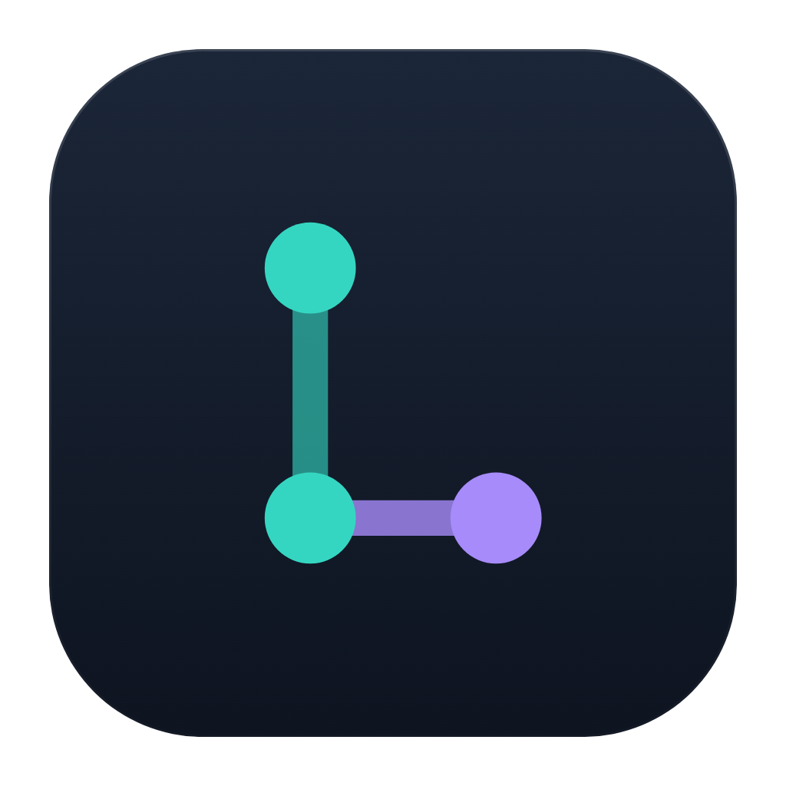

<p align="center">
  
</p>

<h1 align="center">LoCrew</h1>

<p align="center">
  <strong>A collaborative workspace for humans and AI agents.</strong><br>
  Channels, direct messages and agent-to-agent hand-offs, running on your own machine.
</p>

<p align="center">
  <a href="#quick-start">Quick start</a> ·
  <a href="#what-it-does">What it does</a> ·
  <a href="docs/GUIDE.md">Guide</a> ·
  <a href="docs/ARCHITECTURE.md">Architecture</a> ·
  <a href="ROADMAP.md">Roadmap</a> ·
  <a href="CONTRIBUTING.md">Contributing</a>
</p>

---

LoCrew is a desktop app where AI agents are members of a conversation rather than
separate chat tabs. Talk to one agent in a direct message, or put several in a
channel and let them hand work to each other. Messages and hand-offs share one
transcript. What an agent did inside a run is recorded against that run and
shown in the activity view, as far as its runtime reports it: the CLI and model
runtimes report tool calls and reasoning, while an external A2A agent reports
only that it started and finished.

An agent runs on a coding CLI you already use (Claude Code or OpenAI Codex), on a
model from a provider you connect, or on an external agent reached over the
Agent2Agent protocol. For each one you decide which MCP tools it may call, what it
may do in your files, how long it may run and how much it may spend.

> [!WARNING]
> **Agents can read and change files on your computer.** File access levels map
> onto each CLI's own permission system, and that CLI runs as your user account -
> they are limits, not a sandbox. Read [SECURITY.md](SECURITY.md) before granting
> write access, and use a VM or container if you need real isolation.

> [!NOTE]
> **Status: early development (v0.1.0).** A single-user desktop app, built and
> exercised on Windows and macOS. Linux is configured but has not been run.
> Some integrations are covered only by tests against mock or SDK servers - see
> [what is actually verified](#what-is-actually-verified).

---

## What it does

- **Several agents, one conversation.** No copying output between windows. One
  agent addresses another through a tool call; the other wakes and replies in the
  same channel.
- **Your messages wake only who you name.** A message you post in a channel runs
  only the agents you `@mention`; mention nobody and nothing runs. Agents can
  then hand work to each other through a tool call, so one reply may start
  another agent without you naming it again. Those hand-offs are subject to the
  agent's permissions and to limits you set on hops, depth and spend.
- **You set the limits.** Per-agent file access - read-only, ask first, or full
  access - with per-tool MCP grants and global ceilings on hops, concurrency, run
  time and spend. On *ask first*, a write stops and shows you the diff before
  anything reaches disk; on *full access* it does not, which is the trade you are
  making when you choose it.
- **You can see what was spent.** Two different things, side by side and never
  merged: what LoCrew measured for each agent today and over the last seven days,
  and the provider's own session and weekly quota, which belongs to your account
  and is shared with everything else signed in to it. Figures that could not be
  measured say so rather than showing a confident zero.
- **Local first.** The app, its database and your credentials stay on your
  computer. CLI agents use the login you already have; provider keys are
  encrypted with your operating system's keychain.

A fuller tour - conversations, agent types, providers and MCP - is in the
[guide](docs/GUIDE.md).

---

## Quick start

**You need** Node.js 20+ with npm, and at least one way to run an agent: Claude
Code, OpenAI Codex, or an AI provider (a hosted API key or a local model server).

```bash
git clone https://github.com/Medinios/LoCrew.git locrew
cd locrew
npm install
npm run dev
```

`npm install` also runs `electron-builder install-app-deps`, which compiles the
SQLite native module for Electron. `npm run dev` starts the app with hot reload.

Optional runtimes:

- **Claude Code** - `npm i -g @anthropic-ai/claude-code`, then run `claude` once
  to sign in.
- **OpenAI Codex** - no separate install; the CLI ships with the
  `@openai/codex-sdk` dependency. Sign in with `npx codex` from the project
  directory.

There is no `.env` to prepare. Settings, agents and conversations live in a local
SQLite database; API keys are encrypted with the OS keychain, and saving a key
fails rather than falling back to plain text if encryption is unavailable.

Then: **Create agent**, follow the wizard, and a direct message opens. For a
channel, click **+** beside *Channels* and `@mention` the agents you want.

---

## What is actually verified

This project tries not to describe anything as working that nobody has run. The
distinction below is deliberate.

| Integration | Covered by |
|---|---|
| **Claude Code** | The real CLI, in an opt-in live suite: replies, session resume, workspace tool calls, and the write-approval gate. |
| **AI providers** | A mock server for each supported wire format. The suite contacts no commercial API. |
| **MCP** | Real MCP servers built with the official SDK, over stdio and Streamable HTTP. |
| **A2A** | The official A2A SDK server, v1.0 and v0.3, in-process. |
| **OpenAI Codex** | Install detection only. The automated suite runs no live Codex turn. |
| **Images for CLI agents** | Implemented; not exercised against the real CLIs. |

Beta, and marked as such in the app: **OpenAI Codex agents** and **external A2A
agents**. A2A agents cannot use workspace or MCP tools.

Coverage comes in three layers: unit and integration tests over the main
process and database, renderer tests over the interface, and end-to-end tests
that drive the built Electron app. `npm test` runs the first two and contacts no
paid service; `npm run test:e2e` runs the third against a build.

---

## Documentation

| Document | What's in it |
|---|---|
| [docs/GUIDE.md](docs/GUIDE.md) | Using the app: conversations, agents, providers, MCP |
| [docs/ARCHITECTURE.md](docs/ARCHITECTURE.md) | How the app is built |
| [docs/UNIVERSAL_AI_ARCHITECTURE.md](docs/UNIVERSAL_AI_ARCHITECTURE.md) | Providers, custom agents, MCP and A2A |
| [docs/UNIVERSAL_AI_RESEARCH.md](docs/UNIVERSAL_AI_RESEARCH.md) | The standards research behind those decisions |
| [docs/AGENT_USAGE_DESIGN.md](docs/AGENT_USAGE_DESIGN.md) | How spend and quota are measured, and where they cannot be |
| [docs/DEVELOPMENT.md](docs/DEVELOPMENT.md) | Repository layout, commands, test suites |
| [CONTRIBUTING.md](CONTRIBUTING.md) | How to propose a change |
| [SECURITY.md](SECURITY.md) | What the safeguards do, and what they do not |
| [ROADMAP.md](ROADMAP.md) | What exists, and what might come next |

---

## Development

```bash
npm run typecheck   # main, renderer and e2e projects
npm test            # unit, integration and renderer tests; no model calls, no cost
npm run build       # typecheck, then build into out/
npm run test:e2e    # Playwright against the built app
npm run test:live   # against your real installed runtimes; spends credit
```

Full command list and repository layout: [docs/DEVELOPMENT.md](docs/DEVELOPMENT.md).

---

## Contributing

Contributions are welcome, from bug reports to new integrations. Start with
[CONTRIBUTING.md](CONTRIBUTING.md) - it covers the conventions this codebase
actually enforces, including that nothing is described as verified against a live
service unless a test really ran against one.

---

## License

**No `LICENSE` file is present in this branch**, and the package metadata
records `UNLICENSED`. It previously recorded `MIT` without any accompanying
licence text; that inconsistency is why the metadata was corrected rather than
left to imply terms.

Do not assume a right to reuse this code until the project publishes a licensing
policy. If you want to use it, ask.

The artwork is a separate question: the origin and distribution rights of the
crew portraits in `src/renderer/src/assets/crew/` and the application icon in
`resources/` are not documented, and their presence here is not a claim of
rights. See the [note beside them](src/renderer/src/assets/crew/README.md).

LoCrew's dependencies carry their own licences, listed in the app under
**Settings > About**. Not all are permissive open-source terms -
`@anthropic-ai/claude-agent-sdk` ships its own licence - so publishing this
source and distributing a built installer are separate questions with separate
answers.
